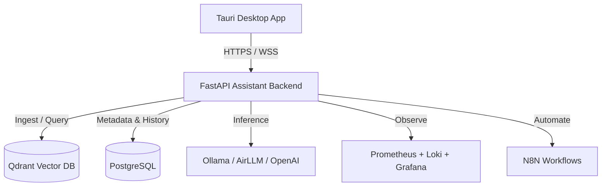

# K.A.O.S — Knowledge & Agentic Orchestration System

K.A.O.S is a premium, monorepo-based developer platform that connects local/remote Large Language Models (LLMs) with private Knowledge Vaults (Obsidian), Model Context Protocol (MCP) servers, and custom agentic workflows. It includes a FastAPI-based orchestration backend and a Tauri desktop application for live telemetry, chat, and service registries.

---

## 🏗️ Architecture Overview

The monorepo is structured into three main layers:



1. **Assistant Backend (`/assistant`)**: 
   - A FastAPI orchestration hub using LangGraph, SQLAlchemy (Async), and PostgreSQL.
   - Dynamic Model Routing supporting Ollama, OpenAI, Anthropic, Gemini, and local streaming via AirLLM.
   - Vector indexing pipeline for Obsidian Vault files stored in Qdrant.
   - Dynamic Model Context Protocol (MCP) manager and LangGraph adapter.

2. **Desktop Launcher (`/desktop`)**:
   - A desktop app built with Tauri 2, React, TypeScript, and Tailwind CSS.
   - Interactive Chat panel, RAG Knowledge Viewer (with styled markdown previews), and active pipeline monitor.
   - **Tools & Registry Panel**: Add/monitor MCP servers and browse `.opencode` extension elements (rules, skills, references).
   - Real-time hardware telemetry (CPU, VRAM, Latency).

3. **OpenCode Configuration (`/.opencode`)**:
   - Project-level agent schemas, custom execution rules, workflow guidelines, and tools dynamically read by the backend.

4. **Infrastructure Services (`/infra`)**:
   - Docker Compose recipes managing PostgreSQL, Qdrant, N8N, Ollama, Prometheus, Loki, Promtail, and Grafana.

---

## ✨ Features Checklist

* **Unified Telemetry Dashboard**: Live service statuses, vector count, VRAM utilization, and average latencies.
* **Knowledge Vault**: Indexing Obsidian markdown vaults to Qdrant with semantic search capability and a high-fidelity Markdown previewer.
* **MCP Integration**: Dynamic server registration in runtime with interactive JSON-schema rendering for active tools.
* **OpenCode Catalog**: Dynamic scanning of project-level rules, custom prompt mappings, and commands.
* **Auto-Updates & Security**: Preflight CORS protection, package signing with minisign/cosign, and update proxies.

---

## 🚀 Getting Started

### 1. Prerequisites
- [Docker](https://www.docker.com/) and Docker Compose.
- [Node.js](https://nodejs.org/) (v20 or v22) & npm.
- [Rust](https://www.rust-lang.org/) (stable) for compiling the Tauri app.
- [uv](https://github.com/astral-sh/uv) python package manager.

### 2. Startup Infrastructure
Navigate to the docker infrastructure directory and launch the services:
```bash
cd infra/docker
docker compose up -d
```
This launches Qdrant, Postgres, Ollama, N8N, Prometheus, Loki, Grafana, and rebuilds the `kaos-api` backend server with the proper volume mounts.

### 3. Run the Desktop Launcher
Go to the desktop directory, install frontend dependencies, and launch Tauri in development mode:
```bash
cd ../../desktop
npm install
npm run tauri dev
```

---

## 🧪 Running Tests & Linting

### Backend Lint & Tests (Python)
Checks format compliance using Ruff and runs unit integration tests:
```bash
cd assistant
uv run ruff check .
uv run ruff format --check .
uv run pytest tests/ -v --asyncio-mode=auto
```

### Frontend Build Verification (Vite/TypeScript)
Compiles TypeScript and bundles the Vite app for production:
```bash
cd desktop
npm run build
```

---

## 📦 CI/CD & Releases

The project utilizes GitHub Actions for continuous validation:
- **Lint & Test**: Executed automatically on every pull request to `dev` and `main`.
- **Release Builder**: Triggering a version tag (e.g., `v2.0.1`) kicks off a multi-platform runner (`windows-latest`, `ubuntu-latest`, `macos-latest`) that signs binaries, uploads artifacts, and deploys update manifests automatically.

---

## 🤝 Conventional Commits

We follow standard conventional commit governance:
- **Types**: `feat`, `fix`, `refactor`, `test`, `docs`, `ci`, `chore`, `style`, `perf`.
- **Formatting**: Short description must be in lower-case and have a maximum length of 100 characters. Example:
  `feat: integrate tools and registry page for mcp and opencode features`
