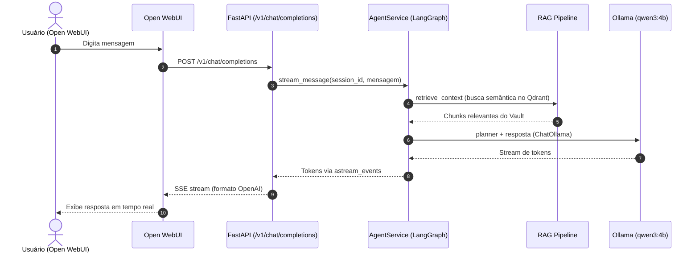
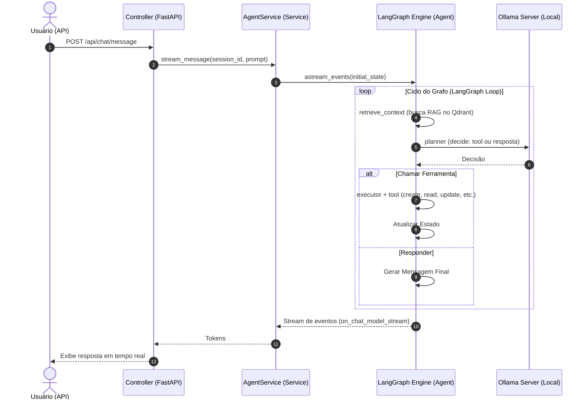

Source: Notas no ClickUp
Tags: #langgraph #agente #fluxo #fastapi #proxy #openai
Related: [[index]] [[01_estrutura_pastas]] [[sdd_obsidian_memoria]]

# Fluxo de Dados e Ciclo de Vida do Agente

Esta nota documenta os dois caminhos que uma mensagem percorre: via **proxy OpenAI** (fluxo principal do Open WebUI) e via **API direta** (fluxo do LangGraph com ferramentas).

---

## Fluxo Principal — Proxy OpenAI (/v1/chat/completions)

Usado pelo Open WebUI. O FastAPI atua como um proxy compatível com a API da OpenAI, roteando via LangGraph Agent.

---

## Fluxo Interno — API Direta com LangGraph

Usado para requisições diretas, executando o grafo completo (RAG + tools).

---

## Relacao com outras Notas
- [[sdd_arquitetura_orquestracao]] — SDD detalhada do proxy gateway
