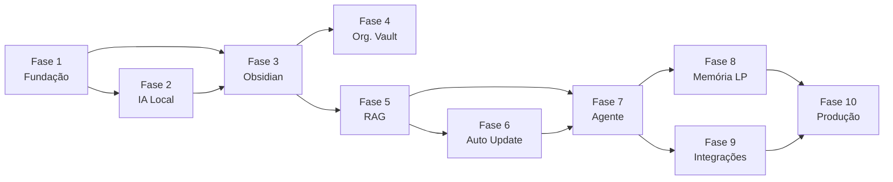

Source: Antigravity AI
Tags: #backlog #planejamento #roadmap
Related: [[index]] [[sdd_obsidian_memoria]] [[00_visao_geral]]

# 📋 Backlog — IA Pessoal Offline com Obsidian

> Rastreamento completo de todas as tarefas de desenvolvimento, organizadas por fase e prioridade.

---

## 📊 Visão Geral de Progresso

| Fase | Nome | Itens | Status |
| :---: | :--- | :---: | :---: |
| 1 | Fundação | 7 | ✅ Completa |
| 2 | IA Local | 10 | ✅ Completa |
| 3 | Integração Obsidian | 14 | 🔵 Próxima |
| 4 | Organização do Vault | 11 | ⬜ Aguardando |
| 5 | RAG | 6 | 🟡 Em andamento |
| 6 | Atualização Automática | 5 | ⬜ Aguardando |
| 7 | Agente Inteligente | 6 | 🟡 Em andamento |
| 8 | Memória de Longo Prazo | 6 | ⬜ Aguardando |
| 9 | Integrações Online | 6 | ⬜ Aguardando |
| 10 | Produção | 6 | ⬜ Aguardando |

---

## 🗺️ Mapa de Dependências entre Fases

---

## 🚀 Próximas Tarefas Prioritárias

- [ ] Implementar rota RAG no grafo LangGraph (recuperar contexto antes de responder)
- [ ] Confirmar integração do Vault Watcher com o pipeline de indexação
- [ ] Testar fluxo completo: Open WebUI → FastAPI → LangGraph → RAG → Ollama

---

## Fase 1 — Fundação ✅

> Relacionado: [[01_estrutura_pastas]]

- [x] Configurar Python 3.13
- [x] Configurar ambiente virtual (`uv`)
- [x] Estruturar projeto base (`app/`, `tests/`, `docker/`, `docs/`)
- [x] Configurar Docker Compose (serviços base)
- [x] Configurar FastAPI (ponto de entrada + health check)
- [x] Configurar sistema de logs (`loguru`)
- [x] Configurar arquivos de ambiente (`.env` + `pydantic-settings`)

---

## Fase 2 — IA Local ✅

> Relacionado: [[sdd_fase2_ia_local]] [[sdd_arquitetura_orquestracao]]

- [x] Instalar Ollama
- [x] Baixar modelo Qwen3 4B (`ollama pull qwen3:4b`)
- [x] Criar serviço de comunicação com Ollama (`app/service/llm_service.py`)
- [x] Criar endpoint de chat (`POST /api/chat/message`)
- [x] Integrar Open WebUI (configurar no Docker Compose)
- [x] Validar funcionamento 100% offline
- [x] Criar proxy OpenAI (`POST /v1/chat/completions`) em `app/api/openai.py`
- [x] Criar system prompt do K.A.O.S. em `app/config/prompts.py`
- [x] Configurar CORS no FastAPI
- [x] Aumentar timeout do LLMService (120s → 600s)

---

## Fase 3 — Integração com Obsidian

> Relacionado: [[sdd_obsidian_tools]] [[sdd_obsidian_memoria]]

### ⚙️ Configuração

- [x] Identificar caminho absoluto do Vault no sistema
- [x] Configurar `OBSIDIAN_VAULT_PATH` no `.env`
- [x] Criar módulo `app/obsidian/` com `__init__.py`

### 📖 Leitura

- [x] Implementar `ObsidianService` (`app/obsidian/services/obsidian_service.py`)
- [x] Implementar `ReadNoteTool` — leitura de nota por caminho relativo
- [ ] Implementar `ListNotesTool` — listagem de notas por pasta
- [x] Testar leitura de arquivos Markdown existentes no Vault

### ✏️ Escrita

- [x] Implementar `CreateNoteTool` — criação de nota com título, pasta e conteúdo
- [x] Implementar `UpdateNoteTool` — sobrescrição ou append de nota existente
- [x] Implementar `DeleteNoteTool` — remoção de nota com tratamento de erros
- [ ] Validar criação de notas geradas pelo Python no Obsidian

### 🔍 Busca

- [x] Implementar `SearchNotesTool` — busca textual por palavra-chave
- [ ] Implementar busca textual com `grep` / walk do filesystem
- [x] Criar testes automatizados para todas as tools (`tests/unit/obsidian/`)

---

## Fase 4 — Organização do Vault

- [ ] Criar estrutura padrão de pastas no Vault

Pastas a criar:

- [ ] `Projetos/` — status e escopo de projetos ativos
- [ ] `Arquitetura/` — decisões e padrões arquiteturais
- [ ] `SDD/` — System Design Documents
- [ ] `Estudos/` — resumos de aprendizado
- [ ] `IA/` — prompts, modelos e experimentos
- [ ] `Python/` — padrões, libs e tutoriais Python
- [ ] `Java/` — ecossistema Java e Spring Boot
- [ ] `AWS/` — infraestrutura e comandos AWS
- [ ] `CI-CD/` — pipelines e automações de deploy
- [ ] `Diário/` — registros diários e resumos de reuniões
- [ ] `Inbox/` — ponto de entrada para notas sem categorização

---

## Fase 5 — RAG 🟡

> Relacionado: [[sdd_obsidian_rag]]

- [x] Subir Qdrant via Docker Compose (`qdrant/qdrant`)
- [x] Configurar embeddings (modelo `sentence-transformers/all-MiniLM-L6-v2`)
- [x] Implementar chunking de documentos (`app/rag/chunking/`)
- [x] Indexar notas do Obsidian (`app/rag/indexer/`)
- [x] Criar retriever semântico (`app/rag/retriever/`)
- [ ] Testar consultas contextuais (validar score de similaridade)

---

## Fase 6 — Atualização Automática

> Relacionado: [[sdd_obsidian_watcher]]

- [x] Adicionar `watchdog` como dependência do projeto
- [x] Detectar evento de **criação** de arquivos `.md`
- [x] Detectar evento de **alteração** de arquivos `.md`
- [x] Detectar evento de **exclusão** de arquivos `.md`
- [ ] Disparar reindexação automática no Qdrant para cada evento

---

## Fase 7 — Agente Inteligente 🟡

> Relacionado: [[02_fluxo_dados]]

- [x] Instalar LangGraph (`uv add langgraph`)
- [x] Criar `Agent Orchestrator` (`app/agent/graph.py`) com nós e arestas condicionais
- [x] Criar `Tool Registry` — mapeamento de ferramentas disponíveis ao agente
- [x] Integrar ferramentas do Obsidian ao Tool Registry
- [x] Implementar nó de planejamento de tarefas (`planner`)
- [ ] Conectar o grafo LangGraph ao endpoint de chat

---

## Fase 8 — Memória de Longo Prazo

- [ ] Criar memória de preferências (`Vault/IA/preferencias.md`)
- [ ] Criar memória de projetos (notas em `Vault/Projetos/`)
- [ ] Criar memória de arquitetura (notas em `Vault/Arquitetura/`)
- [ ] Criar memória de estudos (notas em `Vault/Estudos/`)
- [ ] Implementar comando **"salve esta conversa"** → `CreateNoteTool`
- [ ] Implementar comando **"atualize esta nota"** → busca + `UpdateNoteTool`

---

## Fase 9 — Integrações Online

- [ ] Subir N8N via Docker Compose
- [ ] Criar integração via Webhook (N8N recebe e envia eventos ao FastAPI)
- [ ] Integrar GitHub (consulta de repositórios e código)
- [ ] Integrar Email (leitura e triagem de mensagens)
- [ ] Integrar WhatsApp (via N8N + Evolution API)
- [ ] Integrar AWS (comandos CLI e monitoramento)

---

## Fase 10 — Produção

- [ ] Configurar autenticação (JWT ou API Key no FastAPI)
- [ ] Configurar backups automáticos do Vault (script + cron)
- [ ] Configurar monitoramento (Prometheus + Grafana ou Loki)
- [ ] Configurar CI/CD (GitHub Actions para lint, tests e build)
- [ ] Criar documentação técnica (`docs/README_tecnico.md`)
- [ ] Criar documentação de instalação (`docs/INSTALL.md`)

---

*Atualizado automaticamente — acesse [[index]] para o hub central de documentação.*
