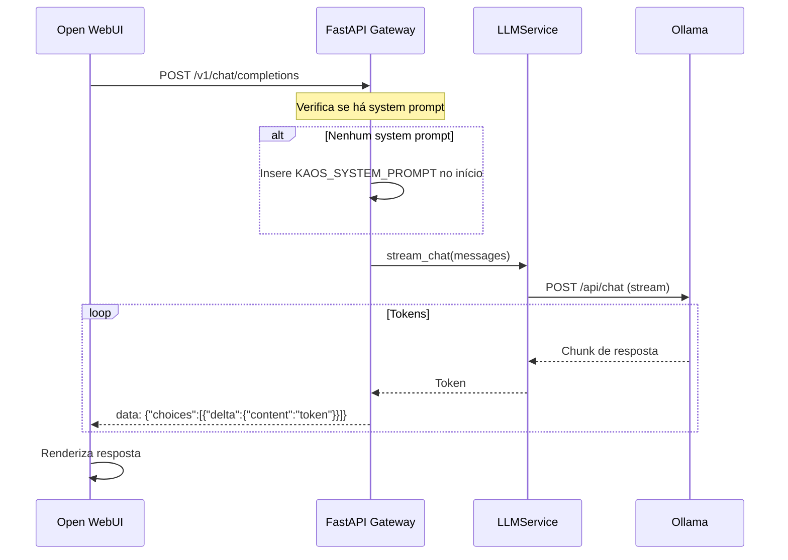

Source: Antigravity AI
Tags: #sdd #python #fastapi #proxy #openai #gateway
Related: [[index]] [[00_visao_geral]] [[02_fluxo_dados]] [[sdd_fase2_ia_local]]

# SDD — Proxy OpenAI & Gateway de Orquestração

## Objetivo

Documentar a arquitetura do proxy OpenAI-compatível que roteia requisições do Open WebUI através do FastAPI, injetando o system prompt do K.A.O.S. e garantindo que todo o tráfego passe pelo gateway antes de chegar ao Ollama.

---

## Visão Geral

O Open WebUI não se conecta diretamente ao Ollama. Em vez disso, é configurado no **modo OpenAI**, apontando para o FastAPI:

```
Open WebUI → FastAPI (/v1/chat/completions) → LLMService → Ollama
```

Isso garante:
- Injeção obrigatória do system prompt do K.A.O.S.
- CORS habilitado para requisições cross-origin do container
- Um ponto único de controle para logging, monitoramento e futuras transformações
- Compatibilidade total com o formato OpenAI (qualquer cliente OpenAI pode usar)

---

## Arquitetura

```mermaid
graph LR
    OWUI[Open WebUI] -->|OpenAI API| GW[FastAPI Gateway]
    GW -->|Streaming| OLLAMA[Ollama qwen3:4b]
    
    subgraph FastAPI["FastAPI (porta 8000)"]
        OAI[/v1/chat/completions]
        CHAT[/api/chat/message]
        INDEX[/indexing/full]
        RAG[/rag/context]
    end
    
    OWUI --> OAI
    OAI -->|system prompt| OLLAMA
```

---

## Endpoints do Gateway

| Endpoint | Descrição | Streaming |
| :------- | :-------- | :-------: |
| `GET /` | Root — informações do serviço | ❌ |
| `GET /health` | Health check | ❌ |
| `GET /health/readiness` | Readiness check (inclui Ollama) | ❌ |
| `POST /api/chat/message` | Chat interno (LangGraph) | ✅ |
| `POST /v1/chat/completions` | Proxy OpenAI (usado pelo Open WebUI) | ✅ |
| `GET /v1/models` | Lista modelos disponíveis | ❌ |
| `POST /indexing/full` | Reindexação completa do vault | ❌ |
| `POST /rag/context` | Busca contexto RAG | ❌ |

---

## Fluxo do Proxy OpenAI



---

## System Prompt do K.A.O.S.

Definido em `assistant/app/config/prompts.py`. Injetado automaticamente se o payload não contiver um `role: system`.

```python
KAOS_SYSTEM_PROMPT = """Você é K.A.O.S. (Knowledge Assistant & Offline System)..."""
```

---

## Configuração do Open WebUI

No `docker-compose.yml`, o Open WebUI é configurado para usar o FastAPI como backend OpenAI:

```yaml
environment:
  - OPENAI_API_BASE_URL=http://host.docker.internal:8000
  - OPENAI_API_KEY=kaos-local
  - DEFAULT_MODEL=qwen3:4b
```

- `host.docker.internal:8000` → Resolve o host da máquina de dentro do container
- `OPENAI_API_KEY` → Qualquer valor (o proxy não valida localmente)
- `DEFAULT_MODEL` → Modelo padrão exibido na UI

---

## Considerações de Segurança

- Atualmente sem autenticação (ambiente local)
- O CORS permite todas as origens (`allow_origins=["*"]`)
- Para produção, adicionar validação de API Key e restringir CORS

---

## Dependências

- [[sdd_fase2_ia_local]] — Implementação do LLMService e endpoint de chat

## Desbloqueia

- Integração com qualquer cliente compatível com OpenAI API
- Futura camada de autenticação e rate limiting
- Middleware de logging e tracing centralizado
