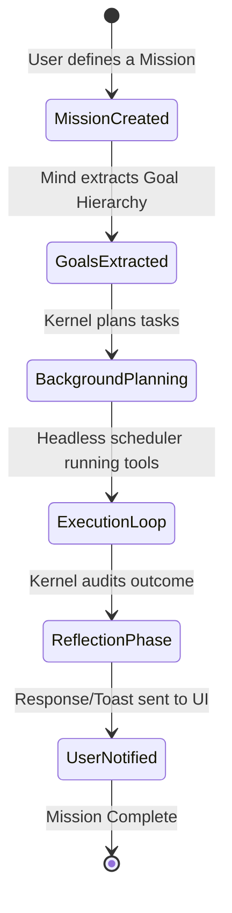

# PRODUCT Epic - ARCHITECTURE: K.A.O.S Product Domain Map

## 1. Product Capabilities Hierarchy

To hide complex backend technologies, the product is structured around nine core user-facing capabilities:

```text
                                  ┌───────────────────────────┐
                                  │    Product Capabilities   │
                                  └─────────────┬─────────────┘
                                                │
       ┌───────────┬───────────┬───────────┼───────────┬───────────┬───────────┐
       ▼           ▼           ▼           ▼           ▼           ▼           ▼
     Think     Remember     Observe       Act        Learn    Communicate   Protect
  (Planning)   (Memory)   (Guardian)  (Execution) (Reflection)  (Chat/API)  (Security)
```

- **Think:** Formulating plans, routing queries, selecting models, and reasoning through problems.
- **Remember:** Storing conversations, notes, episodic memories, preferences, and personal details.
- **Observe:** Watching files, processes, Windows events, and system resources.
- **Act:** Invoking MCP tools, running terminal commands, updating files, and triggering webhooks.
- **Learn:** Refining agent behavior based on user corrections and system reflection.
- **Communicate:** Interfacing with the user via Chat UI, Voice, CLI, Mobile, WhatsApp, and email.
- **Create:** Generating specifications (SDDs), templates, and structural blueprints.
- **Analyze:** Detecting code drift, finding note contradictions, and measuring costs/latency.
- **Protect:** Encrypting credentials, validating commands against permissions, and sandboxing executions.

---

## 2. Mission & Goal Lifecycle Product Flow

From a product perspective, a user sets a **Mission** which drives automated subgoals.



- **Mission Container:** Keeps track of all assets (notes, commits, logs, tasks, files) created during the mission.
- **Goal Dependency Graph:** Subgoals must be satisfied sequentially or in parallel.
- **Action Triggers:** Scheduled execution (time-based) or event-based execution (perception-based).
