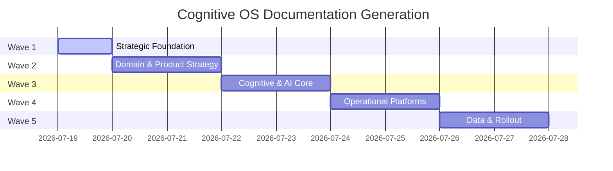

# K.A.O.S Cognitive OS: Future Plan Master Board

Welcome to the **Future Plan Master Board** for **K.A.O.S (Knowledge & Agentic Orchestration System)**. This directory documents the evolutionary blueprint to transition K.A.O.S from a Chat-centric application to a **Cognitive Operating System (Cognitive OS)**.

This board acts like a JIRA project management hub, mapping out strategic epics, architectural contracts, and operational stories for multi-agent and human developers.

---

## 🗺️ Board Structure

The blueprint is organized into 25 domains (`00` to `24`), each representing a JIRA-style Epic. Under each folder, you will find consistent documentation files representing strategy, design, and implementation stories.

```text
future-plan/
├── README.md                 # This master board & index
├── 00-VISION.md              # Global Vision & Paradigm Shift
├── 01-PRODUCT/               # Product Vision, Target Persona, Competitive Matrix
├── 02-BUSINESS/              # Strategy, Monetization, Network Effects
├── 03-ARCHITECTURE/          # System Blueprint, Domains, Event Bus
├── 04-AI/                    # Cognitive Abstractions, Routing, Fallbacks
├── 05-UX/                    # Mind States, Conversational UX, Multi-modal Interfaces
├── 06-DESKTOP/               # Tauri 2 Desktop Service, OS Integrations
├── 07-BACKEND/               # FastAPI Backend, Performance, Memory Managers
├── 08-RUNTIME/               # OS Runtime Registry, Lifecycle, Boot gates
├── 09-MEMORY/                # Working, Semantic, Episodic, Procedural, Preference Memory
├── 10-KNOWLEDGE/             # Knowledge Graphs, Qdrant Vector Space, Relational DBs
├── 11-AUTOMATION/            # Headless Scheduler, n8n Integration, Triggers
├── 12-AGENTS/                # Cognitive Agent Loop, Multi-agent Systems
├── 13-TOOLS/                 # MCP Bridges, Standard Tool Kits, Execution permission
├── 14-OBSERVABILITY/         # Event Bus, Cost tracking, Prometheus, Loki, Grafana
├── 15-SECURITY/              # Credentials, Windows API permissions, Sandboxing
├── 16-PLUGIN-SYSTEM/         # Wasmtime Sandboxes, Marketplace registry
├── 17-DESIGN-SYSTEM/         # Styling guidelines, Glassmorphism, Tailwind/CSS variables
├── 18-DATA/                  # Database Schemas, Alembic Migrations, Serialization
├── 19-DEVEX/                 # Git hooks, KIRL Audit validation, Local testing
├── 20-ROADMAP/               # Domain-specific Gantt & Milestones
├── 21-MIGRATION/             # Phased database, code, and documentation migration
├── 22-RISKS/                 # Security, performance, and API cost risk matrix
├── 23-RESEARCH/              # Reference papers, AI state of the art, comparative research
└── 24-IMPLEMENTATION/        # Epic checklists, user stories, tasks
```

---

## 🗂️ JIRA-like Epic Standard Documents

For each epic folder (`01` through `24`), the following documentation artifacts are generated:

| File Name | Purpose / JIRA Equivalence |
| :--- | :--- |
| `VISION.md` | Strategic objective and epic scope. |
| `ARCHITECTURE.md` | High-level technical diagrams, data flows, and class contracts. |
| `CURRENT_STATE.md` | Analysis of the current codebase implementation. |
| `GAPS.md` | Detailed list of missing capabilities (Backlog items). |
| `PROPOSAL.md` | New architectural solution, trade-offs, and rejected options. |
| `IMPLEMENTATION_PLAN.md` | Detailed step-by-step developer tasks, interfaces, and events. |
| `DECISIONS.md` | Architectural Decision Records (ADRs) taken for this epic. |
| `RISKS.md` | Potential blockages, costs, performance, and security issues. |
| `OPEN_QUESTIONS.md` | Remaining design questions or user feedback items. |
| `REFERENCES.md` | Code references, file links, and technical specifications. |

---

## 🚀 Execution Phases (The Roadmap Waves)

To guarantee depth and precision without exceeding token ceilings, the documentation is created in five consecutive waves:



1. **Wave 1: Strategic Vision & Foundational Mapping** (`README.md`, `00-VISION.md`) — *Active*
2. **Wave 2: Domain-Level Strategy** (`01-PRODUCT`, `02-BUSINESS`, `03-ARCHITECTURE`, `05-UX`, `17-DESIGN-SYSTEM`, `22-RISKS`)
3. **Wave 3: Cognitive & Core Intelligence Systems** (`04-AI`, `09-MEMORY`, `10-KNOWLEDGE`, `12-AGENTS`, `13-TOOLS`)
4. **Wave 4: Operational Platform Systems** (`06-DESKTOP`, `07-BACKEND`, `08-RUNTIME`, `11-AUTOMATION`, `16-PLUGIN-SYSTEM`, `18-DATA`)
5. **Wave 5: Data, Operations & Rollout** (`14-OBSERVABILITY`, `15-SECURITY`, `19-DEVEX`, `20-ROADMAP`, `21-MIGRATION`, `23-RESEARCH`, `24-IMPLEMENTATION`)

---

## 🎯 Main Objectives of this Plan

- **Shift Focus from Chat to Mind:** Elevate the system to run autonomously as a cognitive background service.
- **Provide Actionable Specifications:** Ensure any AI coding assistant or human developer can pick up any task and implement it exactly as defined.
- **Establish Traceability:** Map business strategy in `02-BUSINESS` directly through architecture in `03-ARCHITECTURE` down to specific user stories in `24-IMPLEMENTATION`.
